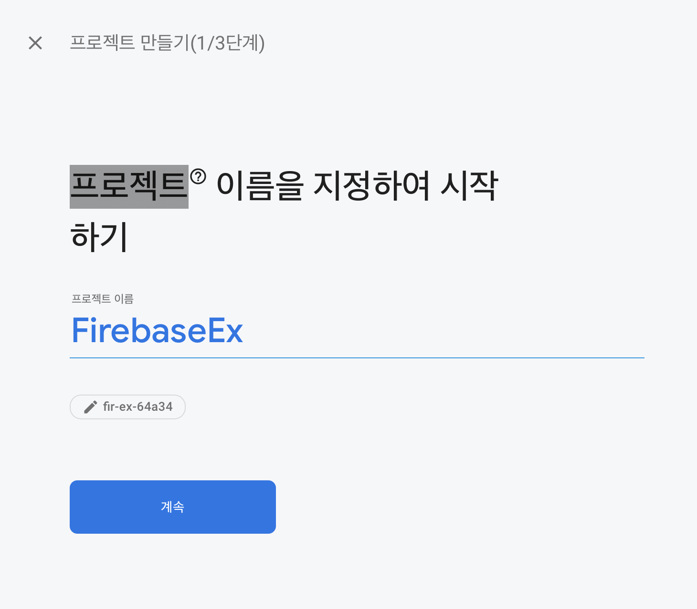
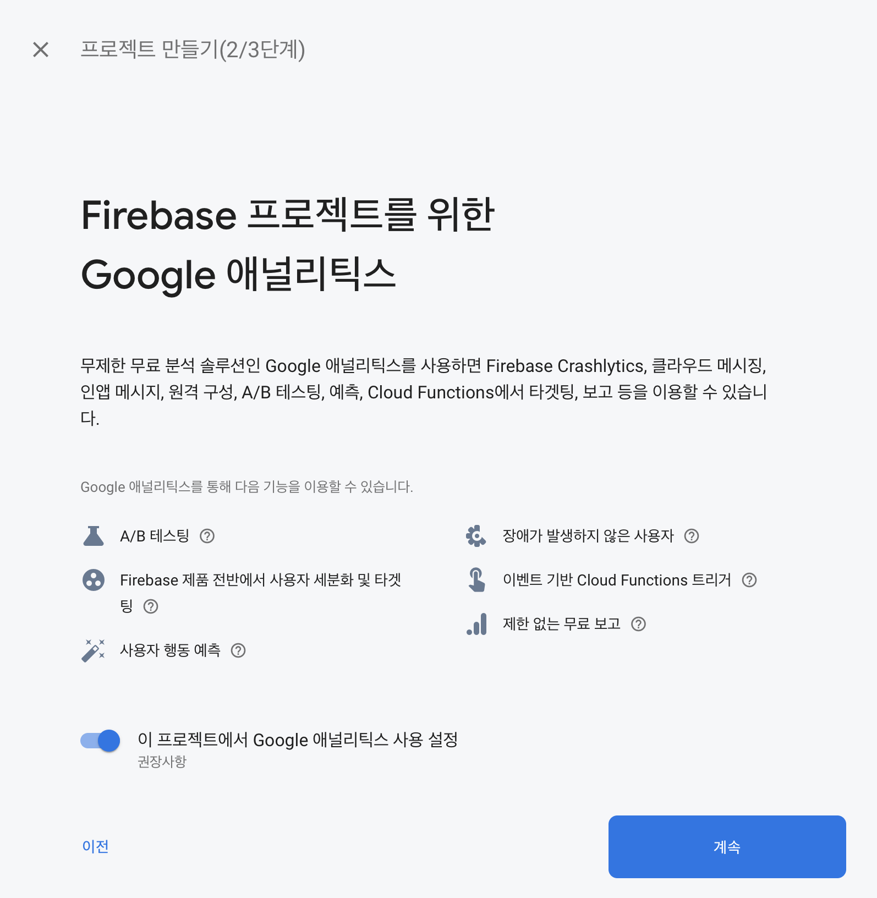
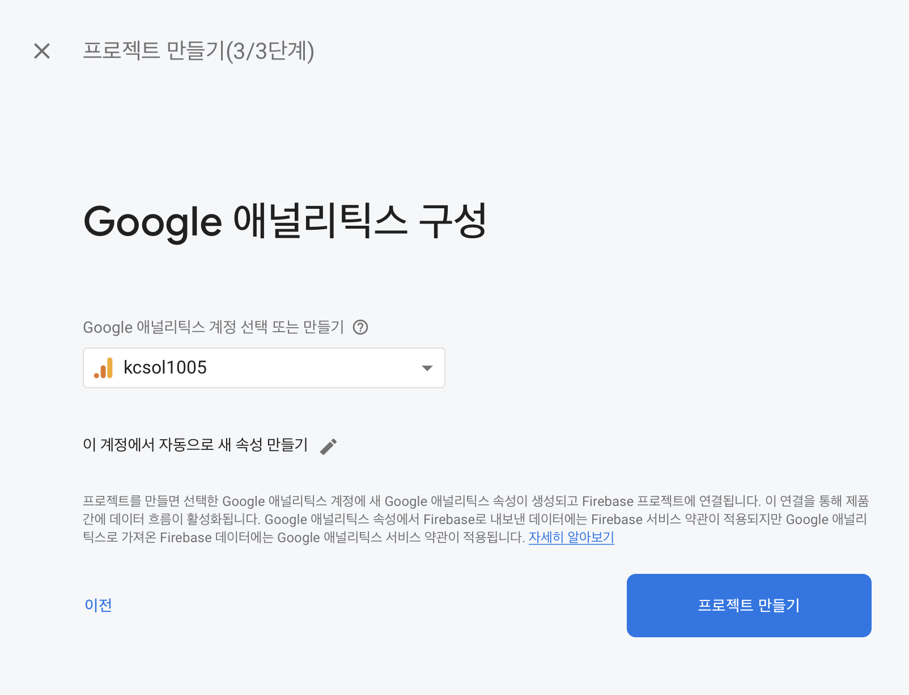
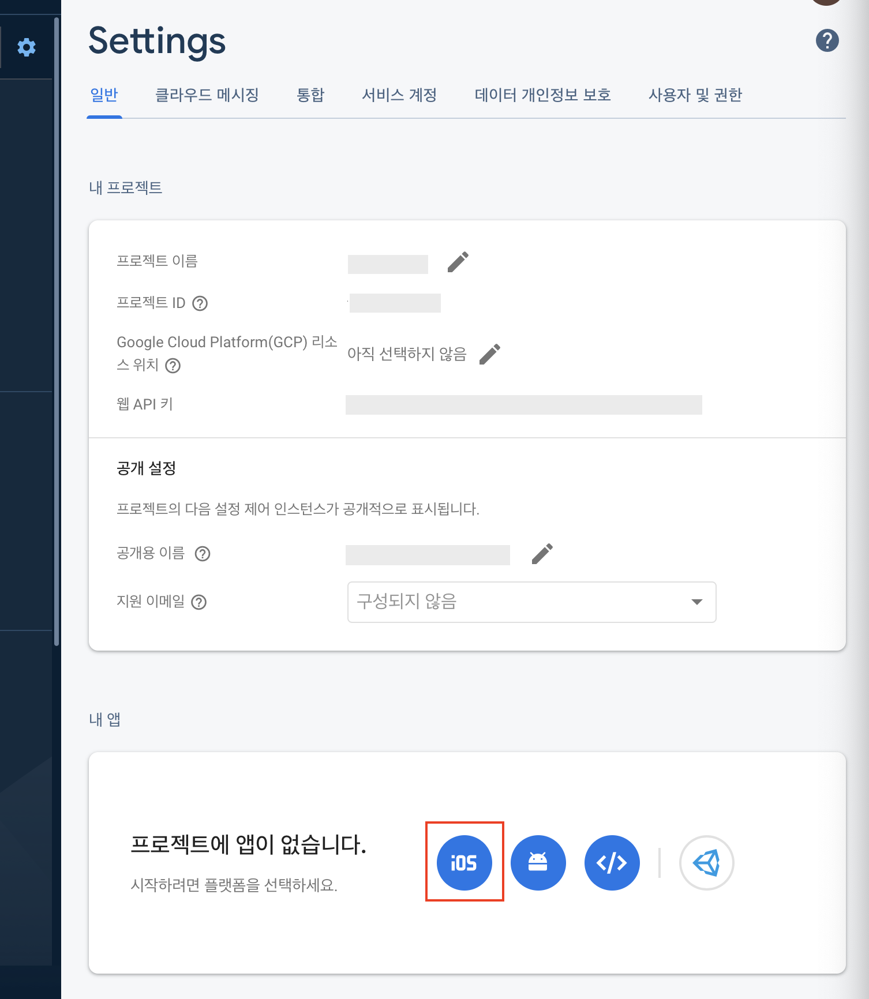
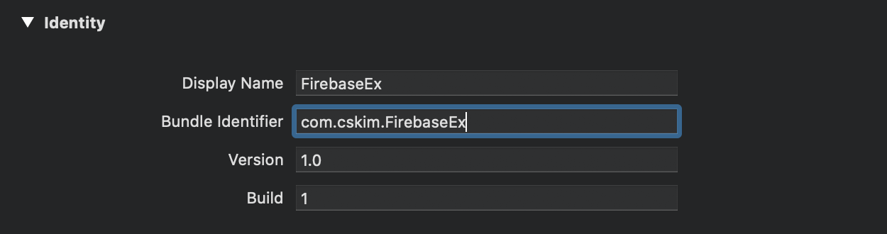
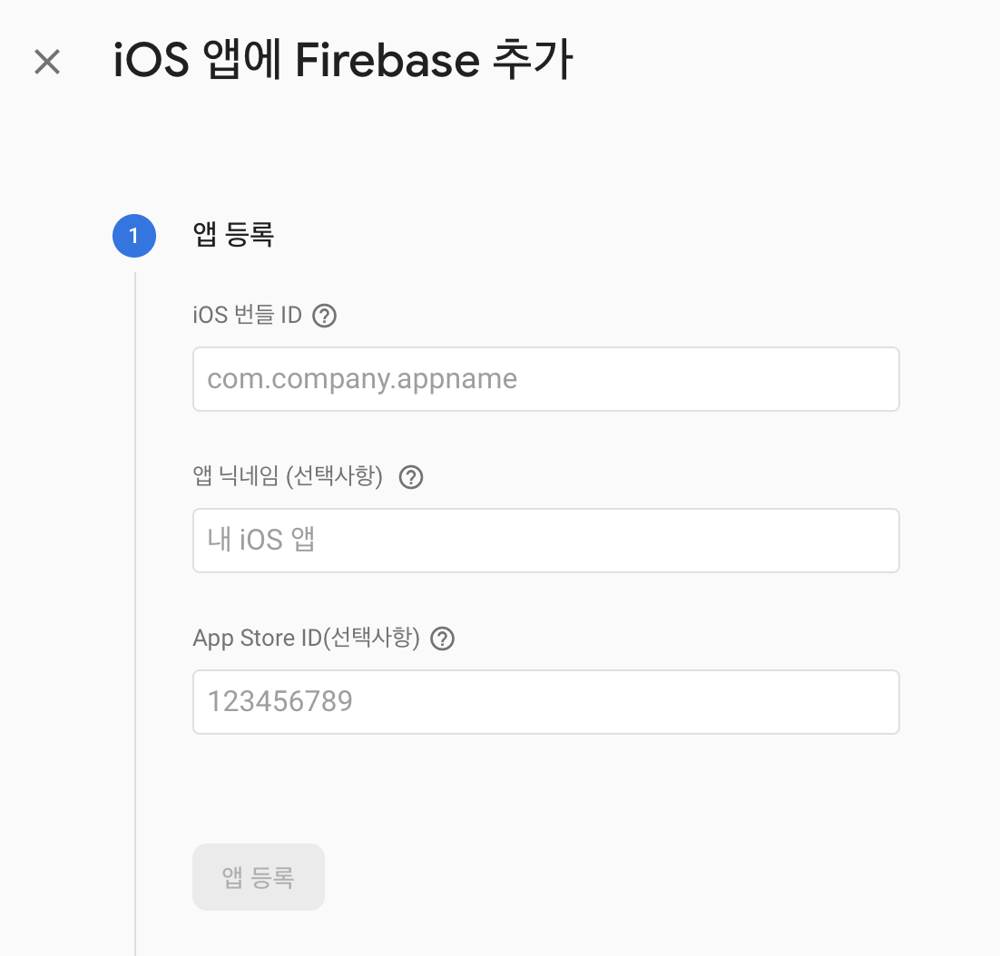
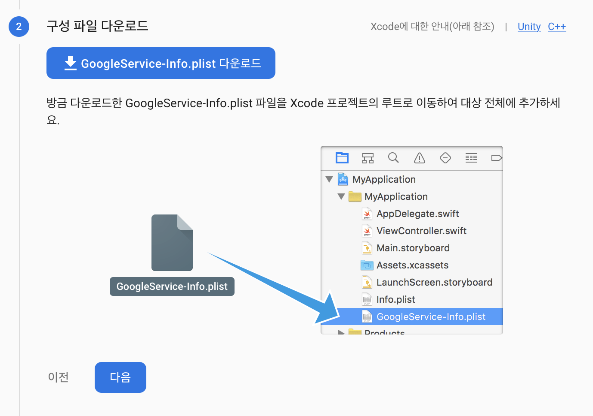

# CH01. Start Firebase

1. [Firebase Console](https://console.firebase.google.com/)에서 프로젝트를 추가

   <p align="center">
     
     
     
   </p>

2. 프로젝트 설정에서 iOS 플랫폼 앱 추가

   <p>
     
   </p>

3. Xcode 프로젝트의 **[Bundle Identifier]**를 [앱 등록] - [iOS 번들 ID]에 입력

   <p align="center">
     
     
   </p>

4. `GoogleService-Info.plist` 구성 파일을 다운받아서 프로젝트에 추가

   <p align="center">
     
   </p>

5. Firebase SDK 추가([iOS 프로젝트 준비하기]()의 Podfile 설정)

   - [사용 가능한 Firebase Pods](https://firebase.google.com/docs/ios/setup#available-pods)를 확인하여 필요한 pod을 추가할 수 있다

   ```shell
   $ pod init
   ```

   ```ruby
   target 'FirebaseExample' do
     pod 'Firebase/Analytics'
   end
   ```

   ```shell
   $ pod install
   ```

6. `*.xcworkspace` 프로젝트를 열고 `AppDelegate`에서 firebase의 초기화 코드 추가

   ```swift
   import UIKit
   import Firebase		// import Firebase
   
   @UIApplicationMain
   class AppDelegate: UIResponder, UIApplicationDelegate {
   
     var window: UIWindow?
   
     func application(_ application: UIApplication,
       didFinishLaunchingWithOptions launchOptions:
         [UIApplicationLaunchOptionsKey: Any]?) -> Bool {
       FirebaseApp.configure()		// Firebase Init
       return true
     }
   }
   ```

7. 앱을 실행하고 Google server와 연결 확인

   - 연결 확인 로딩이 비정상적으로 길어지는 경우 debug log를 확인하여 연결 상태 확인

   - Database에 read/write가 성공적으로 이루어지는지 확인

     ```swift
     override func viewDidLoad() {
     	super.viewDidLoad()
         
       // Write
     	Firestore.firestore()
         .collection("Test")
         .addDocument(data: ["name": "cskim"]) { error in
           if let error = error { print(error.localizedDescription) } 
     			else {
             print("Success")
     
             // Read
             Firestore.firestore()
     	        .collection("Test")
               .getDocuments { (snapshot, error) in
                 if let error = error { print(error.localizedDescription) } 
     						else {
                   guard let document = snapshot?.documents.first else { return }
                   print(document.data())
                 }
             }
           }
       }
     }
     ```